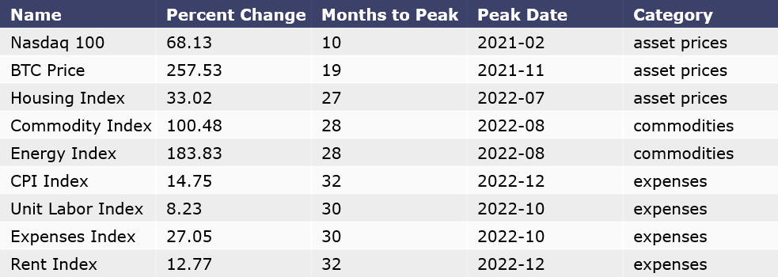

## Visualizing Inflation with Python
A visual study on the lagging effect of post pandemic inflation. This project utilized python, plotly graphing library and Jupyter Notebook to visually explore lagging effects of inflation on asset prices, commodities and consumer expenses.

[project presentation PDF](visualizing_inflation_presentaion.pdf)

[blog post](https://nycdatascience.com/blog/meetup/lagging-effects-of-inflation-visualizing-data-with-python/)

### Summary Table of Lagging Effects of Inflation

### Inflation Correlation by Asset

